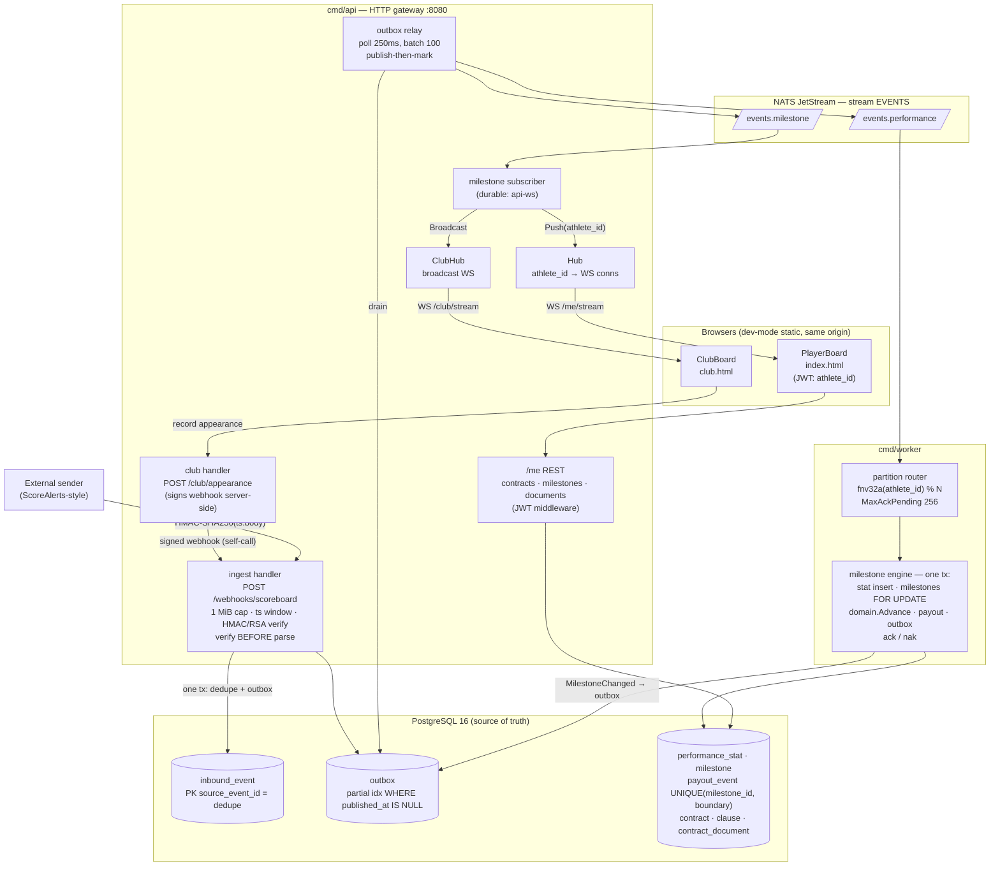
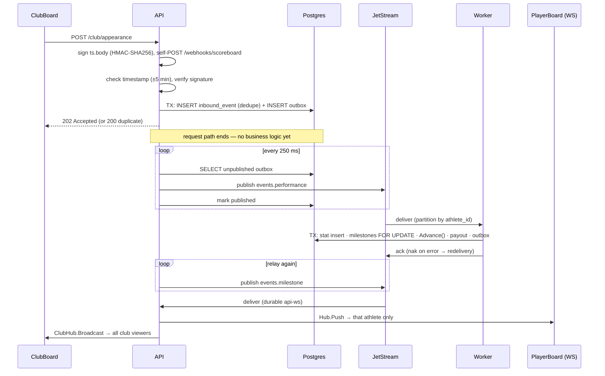

# PlayerBoard — Architecture Diagram

## System overview

## One event, end to end

## Guarantees at a glance

| Concern | Mechanism | Where |
|---|---|---|
| No dual-write loss | transactional outbox | `ingest/handler.go`, `outbox` table |
| Webhook dedupe | PK `source_event_id` | `inbound_event` |
| No double payout | `UNIQUE(milestone_id, boundary)` | `payout_event` |
| Per-athlete ordering | fnv partition (perf) + `FOR UPDATE` (correctness) | `cmd/worker`, engine |
| Replay protection | ±5 min window, ts bound into signature | `ingest/verify.go` |
| WS privacy | athlete_id from JWT claim, never from client | `realtime/hub.go` |
| Delivery | at-least-once everywhere, idempotent consumers | outbox + JetStream ack/nak |
